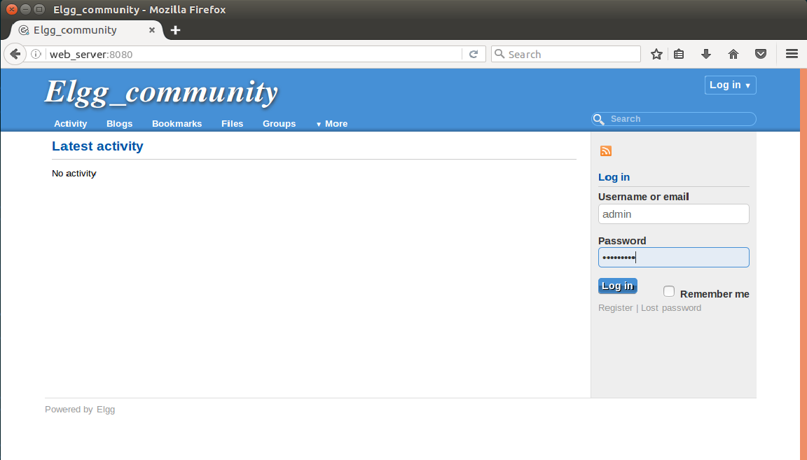

# Web-serving on vSphere Integrated Container Engine

We take the Web-serving benchmark from CloudSuite (http://cloudsuite.ch/webserving/) as an example, to demonstrate how customers who are interested in the LEMP implementation of a cloud native web-serving application could use our guidelines to deploy the system on vSphere Integrated Container Engine 0.7.0 with Docker Compose. This demo has three tiers deployed on three containerVMs: an Nginx Web server, a Memcached server, and a Mysql database server. The Web server runs Elgg (a social networking engine) and connects the Memcached server and the database server through network.

## Workflow

### Build docker image for the Web server (on regular docker)

In the original the Web-server docker image from Cloudsuite, the functionality of “email verification for new user registration” is not enabled, which makes it less realistic and practical. Therefore, we need make some modifications and re-build the docker image for the Web server. **You can also skip this section and proceed to "Compose File for vSphere Integrated Container Engine" if you do not want to build your own image**.

Step I: 
Download the original installation files from https://github.com/ParsaLab/cloudsuite/tree/master/benchmarks/web-serving/web_server

Step II:
In Dockerfile, add “Run apt-get install –y sendmail” and “EXPOSE 25”

Step III:
Replace “bootstrap.sh” with the following:

```
\#!/bin/bash
hname=$(hostname)
line=$(cat /etc/hosts | grep '127.0.0.1')
line2=" web_server web_server.localdomain"
sed -i "/\b\(127.0.0.1\)\b/d" /etc/hosts
echo "$line $line2  $hname" >> /etc/hosts
cat /etc/hosts
service sendmail stop
service sendmail start
service php5-fpm restart
service nginx restart
```
Step IV:
-	Build the image: 
```
$> docker build  -t repo/directory:tag. 
```
-	Login to your registry: (input your credentials when needed)
```
$> docker login 
```
-	upload your image: 
```
$> docker push repo/directory:tag
```

### Compose File for vSphere Integrated Container Engine
```
version: '2'
networks:
   my_net:
     driver: bridge
     
services:
   web_server:
     image: victest/web_elgg
     #image: your_own_image_built_before
     container_name: web_server    
     networks:
       - my_net
     ports:
       - "8080:8080"
       - "25:25"
       
   mysql_server:
     image: cloudsuite/web-serving:db_server
     container_name: mysql_server
     networks:
       - my_net
       
   memcache_server:
     image: cloudsuite/web-serving:memcached_server
     container_name: memcache_server
     networks:
       - my_net    
```

### Deploy to Your VCH

Now assume that you already have a VCH deployed by vic-machine. Then go to the folder where you have the above “docker-compose.yml” file and execute the following command to start the Web-serving application:
```
$> docker-compose -H VCH_IP:VCH_PORT up –d
```
Here VCH_IP and VCH_PORT can be found from the standard output when you use “vic-machine-create” to launch the VCH.
Next on the machine from which you want to open your Web browser, add “VCH_IP web_server” to “/etc/hosts” (for window machines, add “VCH_IP web_server” to “C:\Windows\system32\drivers\etc\hosts”). Now we are ready to view the Website. Open a browser and navigate to http://web_server:8080. You should be able to see the following page:


You can login in as the admin user (username: admin; password: admin1234), or register as a new user with a valid email address (Gmail does not work). You can also create your own contents, invite friends, or chat with others. Enjoy! 

Note that in this example, all the user data and contents are stored on the mysql_server container, which would be gone after you restart the mysql_server. With a later version of vSphere Integrated Container Engine, we will improve this example and allow attaching disk volume to the mysql_server container and persist your data to the volume. 


